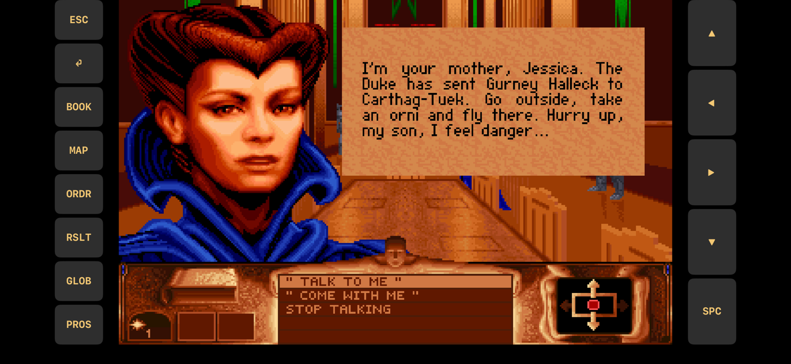
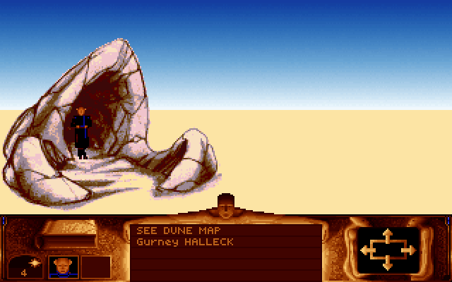
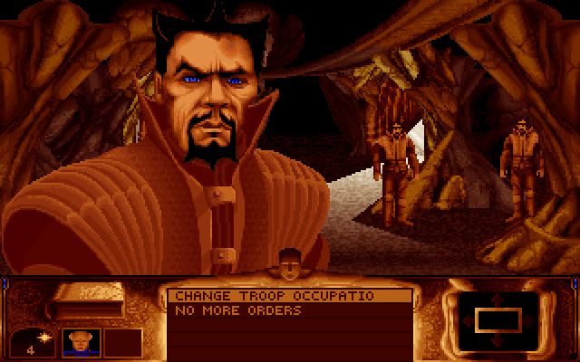
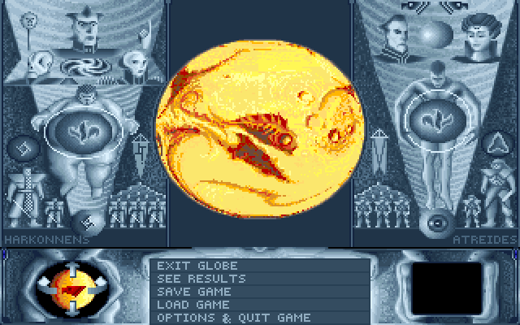
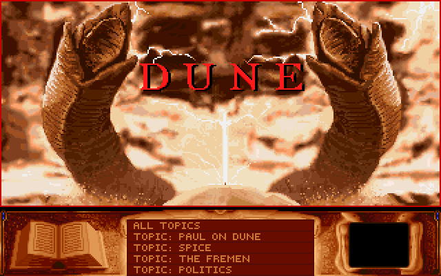

# Dune for iPhone and iPad (SwiftDune iOS port)

A native iPhone and iPad port of **Cryo's *Dune* (1992)**, written in Swift and
Metal. This repository is a fork of Christophe Buguet's
[**swift-dune**](https://github.com/codingstyle/swift-dune), a macOS
reimplementation of the game. The fork adds:

- an **iOS/iPadOS target** that shares the engine and game code with the Mac
  app, with touch controls and on-screen buttons;
- **gameplay from the executable's own data**, ported from the
  [Desert Frost ScummVM engine](https://github.com/AppTesterMC/desert-frost-engine):
  locations, dialogue conditions, the flat map and travel, troops, the day
  clock and the original save format.

The Mac app and the asset editor from the original project still build.

<div align="center">



<br>
<em>Running on iPhone (simulator capture): the game in the middle, touch buttons on both sides.</em>

</div>

> **You need your own copy of the game.** No game files are included. The iOS
> build copies your `DuneFiles/` into the app, so **an IPA you build contains
> the game's data: keep it to yourself and do not share it.**

## Status

This is a development port, not a finished release. It targets the **DOS
floppy release**; the CD release is detected but not playable yet.

| Area | State |
| --- | --- |
| Intro, credits, prologue | done (from the original swift-dune) |
| Palace, sietches, villages, fortresses | rooms, exits and characters from the executable's tables |
| Dialogue | the original CONDIT/DIALOGUE engine with talking portraits |
| Paul's book | topics and encyclopedia pages |
| Flat map, travel, ornithopter flight | place icons, choosing a destination, the animated flight view |
| Globe and game menu | save and load in the original `DUNE21S?.SAV` format, options |
| Troops | rallying Fremen, WORK FOR ME, occupations, spice mining and prospecting |
| Clock and HUD | day and time of day, sun and moon, companions travelling with Paul |
| Visions and the open desert | the first vision, dreams and messages in person |
| The Emperor's shipments and the COMM room | demands, Duncan's bargaining, reminders, shipping from the COMM room, messages |
| Scripted story scenes | the " Continue..." sequences read from the executable |
| Endings | the Emperor's ending and the final cast list (text only) |
| Not yet | troop marches, ecology, battles, worms, the other endings, music per place, the CD release |

[`SCUMMVM_GAP_ANALYSIS.md`](SCUMMVM_GAP_ANALYSIS.md) lists in detail what the
ScummVM engine already has and this port still lacks; [`TODO.md`](TODO.md)
tracks the rest.

<div align="center">

| | |
| --- | --- |
|  |  |
| Arriving at a sietch | A Fremen chief and his troop |
|  |  |
| The globe and the game menu | Paul's book |

</div>

## Game data

Put the files of the **DOS floppy release** (version 2.1) in a folder called
`DuneFiles/` at the top of this repository: all the loose `*.HSQ` files and
**`DUNEPRG.EXE`**. The game reads its location, room and character tables
from the executable, so it must be there. `DuneFiles/` is gitignored.

Tested with `DUNEPRG.EXE` SHA-256
`021e6767485735e643fdb842aa0850f339b2e5114a5142e4d7c8a10d0dc6bea7`.
Check yours with `shasum -a 256 DuneFiles/DUNEPRG.EXE`.

## Building for iPhone and iPad

You need a Mac with Xcode (tested with Xcode 26.6) and
[XcodeGen](https://github.com/yonaskolb/XcodeGen). The app runs on iOS 16 and
later.

```sh
brew install xcodegen
scripts/build_ios.sh
```

The script generates `SwiftDuneiOS.xcodeproj` from
[`project-ios.yml`](project-ios.yml), builds a release app and packages it as
`builds/SwiftDune-ios-<timestamp>.ipa`.

- The iOS SDK defaults to `iphoneos26.5`. Set `IOS_SDK=iphoneos<version>` to
  match your Xcode (`xcodebuild -showsdks` lists them).
- The IPA is **ad-hoc signed**. Sideload it, or open
  `SwiftDuneiOS.xcodeproj` in Xcode and run it on your device with your own
  signing team.
- `scripts/build_ios.sh sim` builds for the iOS simulator instead.
- `scripts/sim_run.sh <name> <seconds> [VAR=value ...]` runs the app in the
  simulator and saves screenshots and the log to `build/shots/<name>/`. The
  `DUNE_*` variables that script and test the game are described in
  [`IOS_PORT.md`](IOS_PORT.md#testing).

On the device the game writes `dune-ios.log` into its Documents folder, which
the Files app shows, so a log can be shared from the phone.

## Controls on iPhone and iPad

| Touch | In the game |
| --- | --- |
| Tap the picture | click at that point |
| Hold or drag a finger on the picture | move the pointer (menus highlight under the finger) |
| Swipe across the picture | arrow key in that direction (move between rooms) |
| ESC, ⏎, SPC | Escape, Return, space (skip the intro, close windows) |
| BOOK, MAP, GLOB | the book, the flat map, the globe and game menu |
| ORDR, RSLT, PROS | change the troop's order, show the results, find prospectors |
| ▲ ◀ ▶ ▼ | arrow keys |
| Hardware keyboard | the same keys as on the Mac |

## Building for the Mac

Open `SwiftDune.xcodeproj` in Xcode and run the **SwiftDune** scheme, or build
from the command line with `scripts/build_swift_dune_local.sh`. That script
stages the sources outside the repository and prints the path of the built
`.app`.

The Mac project has two applications:

- **Editor**: browse the game's assets.
- **Game**: play the game.

## Architecture

The code is in three parts:

- **Engine** (`SwiftDune/Engine`): primitives for reading the original assets
  (HSQ, sprites, rooms, HNM video, HERAD music), world simulation and Metal
  rendering. It is shared by the Mac and iOS apps.
- **Game** (`SwiftDune/Game`): scenes, UI and game logic. `Game/World` holds
  the logic ported from the ScummVM engine: the executable's data segment,
  text codes, dialogue, saves, the flat map and troops.
- **Editor** (`SwiftDune/Editor`): the Mac asset viewer.

The iOS entry point, touch input and buttons are in `SwiftDune/Platform/iOS`.
AppKit-only code is behind `#if os(macOS)`. [`IOS_PORT.md`](IOS_PORT.md)
describes the iOS layer in detail: audio session, logs, shaders, backgrounding
and threading.

The engine follows modern game patterns: events and a node tree.

## Documentation

| File | Contents |
| --- | --- |
| [`IOS_PORT.md`](IOS_PORT.md) | how the iOS port is built, its input mapping and platform behaviour, testing |
| [`SCUMMVM_GAP_ANALYSIS.md`](SCUMMVM_GAP_ANALYSIS.md) | what the ScummVM engine has that this port still lacks, with the rules to port |
| [`ORIGINAL_CLOCK_AND_LOCATION.md`](ORIGINAL_CLOCK_AND_LOCATION.md) | the original game clock and location table, decoded from the executables |
| [`TODO.md`](TODO.md) | the task list |

## Credits

- **Christophe Buguet** ([codingstyle](https://github.com/codingstyle)) wrote
  [swift-dune](https://github.com/codingstyle/swift-dune), the engine, scenes
  and editor this port is built on.
- The gameplay rules come from the
  [Desert Frost ScummVM engine](https://github.com/AppTesterMC/desert-frost-engine),
  which lists its own sources in its `CREDITS.md`.
- Reverse-engineering sources used by both projects:
  [madmoose](https://github.com/madmoose)'s dune-rust and chani database,
  the [OpenRakis](https://github.com/OpenRakis) annotated disassembly,
  [Zwomp](https://zwomp.com/tags/dune/), [Bigs](https://www.bigs.fr/dune_old/)
  and [hsqLib](https://github.com/jeancallisti/hsqLib).

The Dune Reborn community discusses work on the game on
[Discord](https://discord.gg/vxwSUhwRBr).

## Legal

*Dune* (1992) was created by Cryo Interactive and published by Virgin Games.
The game and its assets are copyright their respective rights holders; this
project contains none of them and is not affiliated with or endorsed by them.
The original swift-dune repository has no licence file; its code is used here
with its author's permission.
